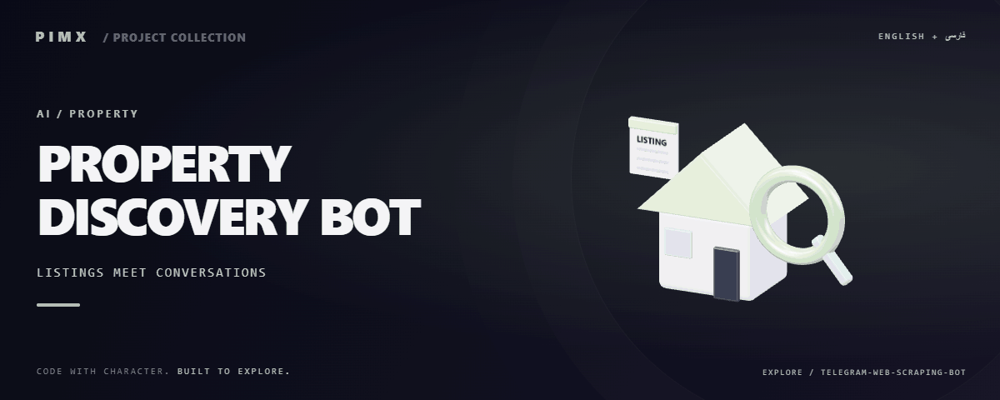

<div align="center">



**[English](README.md) · [فارسی](README.fa.md)**


</div>

# PROPERTY DISCOVERY BOT

مجموعه اسکریپت تلگرام و عامل برای کشف آگهی ملک با اتصال Agno/Gemini و ابزار استخراج Scrapling.

[GitHub](https://github.com/MOHAMMADREZAABEDINPOOR/telegram-web-scraping-bot) · [PIMX / Profile](https://github.com/MOHAMMADREZAABEDINPOOR) · [بنر ثابت](assets/readme/hero.png)

## امکانات

- پرس‌وجو و ابزار استخراج آگهی ملک
- رابط تلگرام در چند نسخه اسکریپت
- اتصال عامل هوش مصنوعی و قالب‌بندی نتیجه
- پردازش شهر و پرس‌وجو برای جست‌وجوی آگهی

## پشته فنی

| ابزار | نسخه یا منبع |
|---|---|
| Python | `standard library / source imports` |

## شروع کار

Python 3 و محیط دسکتاپ برای پروژه‌های Tkinter/Turtle؛ Tkinter از اجزای نصب Python است و با pip نصب نمی‌شود. برای وابستگی‌های قدیمی از نسخه Python سازگار استفاده کنید.

```bash
git clone https://github.com/MOHAMMADREZAABEDINPOOR/telegram-web-scraping-bot.git
cd telegram-web-scraping-bot

python -m pip install agno google-genai scrapling "python-telegram-bot>=20,<23" requests
python telegram_bot_proper.py
```

## تنظیمات

فایل محیط استاندارد تعریف نشده است. برای تمرین‌های مستقل تنظیم خارجی لازم نیست؛ اگر در کد ثابت‌های سرویس یا مسیر وجود دارد، آن‌ها را پیش از اجرا بررسی کنید.

## استفاده

یک نسخه اسکریپت انتخاب، تنظیم سرویس و ربات و وابستگی آن را بررسی کنید. پیش از درخواست تکراری، جست‌وجو را با ربات توسعه آزمایش کنید.

## ساختار پروژه

| مسیر | نقش |
|---|---|
| [`assets/`](assets/) | فایل برند، رسانه و README |
| [`agent.py`](agent.py) | فایل ورودی یا تنظیم پروژه |
| [`telegram_bot.py`](telegram_bot.py) | فایل ورودی یا تنظیم پروژه |
| [`telegram_bot_proper.py`](telegram_bot_proper.py) | فایل ورودی یا تنظیم پروژه |

## فرمان‌ها و بررسی

فرمان آزمون خودکار در manifest تعریف نشده است. اجرای محلی و بررسی رفتار نمونه را انجام دهید.

## استقرار

ربات را با فرایند پایدار، اسرار محیطی و فضای ذخیره خصوصی میزبانی کنید. تنها یک نمونه polling اجرا کنید. تنظیم شبکه و نسخه وابستگی را روی هاست بررسی کنید.

## محدودیت‌ها

فهرست وابستگی قفل‌شده وجود ندارد. ساختار سایت، سیاست دسترسی و API سرویس ممکن است تغییر کند. تنظیم را بررسی و اعتبارنامه توسعه را منتشر نکنید.

## رفع مشکل

- خطای سرویس یا ورود: اعتبارنامه و مدل و سرویس انتخابی را بررسی کنید.
- پیام تلگرام نمی‌رسد: حالت polling و وب‌هوک و نمونه همزمان را بررسی کنید.
- وابستگی غایب: از manifest استفاده یا در نبود آن importها را بررسی کنید.

## مشارکت

برای تغییر، شاخه مستقل بسازید، رفتار فعلی را بررسی کنید و توضیح روشن همراه تغییر بفرستید. اطلاعات خصوصی، خروجی build و دیتابیس محلی را commit نکنید.

## مجوز

فایل مجوز در این نسخه موجود نیست. نمایش عمومی کد به‌تنهایی مجوز استفاده مجدد نیست؛ برای شرایط استفاده با مالک مخزن هماهنگ کنید.

---

ساخته‌شده در مجموعه **PIMX** · مستندات فارسی و انگلیسی.
